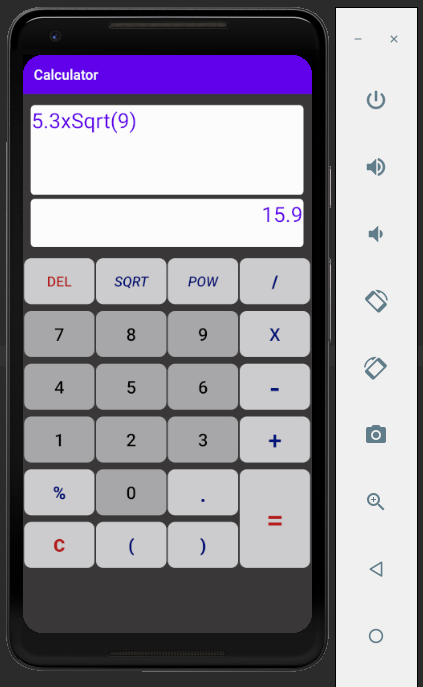

# Calculator-app-Android
<html>
A simple calculator application for android. 
For now, everything seems to be working well except the POW button.

  

 
The XML file for the UI and UX is in res > layout > activity_main.xml

</html>
